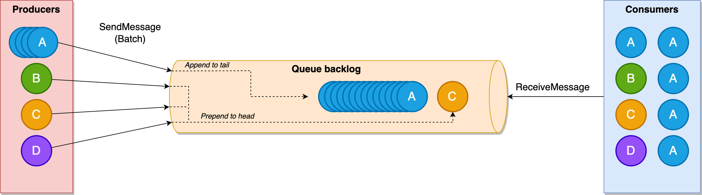
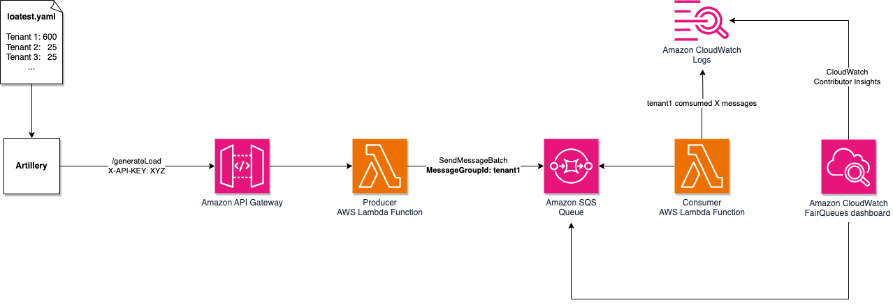
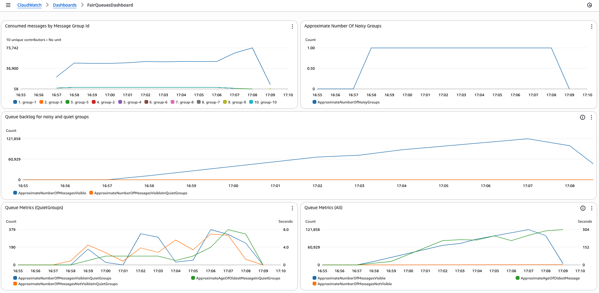

# Amazon SQS fair queues sample

[Amazon SQS fair queues](https://docs.aws.amazon.com/AWSSimpleQueueService/latest/SQSDeveloperGuide/sqs-fair-queues.html) are an extension to Amazon SQS standard queues that mitigate noisy neighbor impact in multi-tenant systems. They maintain consistent time between sending and receiving messages across all tenants. When one tenant sends a disproportionately large volume of messages or has messages that require longer processing time, fair queues ensure other tenants' messages maintain low dwell time. This preserves quality of service for all tenants while maintaining the scalability and throughput of standard queues.



## Sample overview

This sample demonstrates Amazon SQS fair queues behavior by simulating multi-tenant traffic and visualizing the effects through [Amazon CloudWatch dashboards](https://docs.aws.amazon.com/AmazonCloudWatch/latest/monitoring/CloudWatch_Dashboards.html) and [Contributor Insights](https://docs.aws.amazon.com/AmazonCloudWatch/latest/monitoring/ContributorInsights.html).



The architecture consists of the following components:
- **Artillery** - Load generator configured via [loadtest.yaml](infrastructure/loadtest.yaml)
- **API Gateway** - Accepts requests to generate messages for specific tenants
- **Producer Lambda** - Uses `SendMessageBatch` to generate load on the SQS queue
- **SQS Queue** - Standard SQS queue
- **Consumer Lambda** - Processes messages and logs metrics for tenant load analysis
- **CloudWatch Dashboard** - Visualizes metrics and SQS fair queues effectiveness



## Prerequisites

- **AWS Account** 
- **AWS CDK**
  ```bash
  npm install -g aws-cdk
  ```
- **AWS CLI** (configured with credentials)
- **Artillery** (load testing tool)
  ```bash
  npm install -g artillery@latest
  ```

## Quick Start

1. **Build the application**
   ```bash
   cd infrastructure
   npm install && npm run build
   ```

2. **Bootstrap CDK** (if not already done)
   ```bash
   cdk bootstrap
   ```

3. **Deploy infrastructure** (~2 minutes)
   ```bash
   cdk deploy --outputs-file outputs.json
   ```

4. **Set environment variables**
   ```bash
   export API_GW_URL=$(cat outputs.json | jq -r '.CdkSqsFairQueuesStack.ProducerApiEndpoint')
   export API_KEY=$(aws apigateway get-api-key --api-key $(cat outputs.json | jq -r '.CdkSqsFairQueuesStack.ApiKeyValue') --include-value | jq -r '.value')
   ```

5. **Run load test** (10 minutes by default)
   ```bash
   artillery run -t $API_GW_URL loadtest.yaml
   ```

## Cost Considerations

This sample application deploys several AWS services that may incur charges. Understanding these costs is important.

**Amazon SQS**
- **Message requests**: Charged per 1 million requests (send, receive, delete)
- **Dead Letter Queue**: Additional storage and request costs for failed messages
- **Fair queues**: Additional charge for fair queue behavior

**AWS Lambda**
- **Producer Lambda**: Invocations triggered by API Gateway requests
- **Consumer Lambda**: Invocations triggered by SQS messages (up to 40 concurrent executions)
- **Compute time**: Charged per GB-second of execution time
- **Memory allocation**: Producer (1024 MB), Consumer (default 128 MB)

**Amazon API Gateway**
- **API calls**: Charged per million API requests
- **Data transfer**: Outbound data transfer charges apply

**Amazon CloudWatch**
- **Log ingestion**: Consumer Lambda generates structured JSON logs for every processed message batch
- **Log storage**: 1-week retention period configured
- **Dashboard**: Monthly charge for active dashboards
- **Contributor Insights**: Charges for rule processing and data analysis

### Cost Monitoring

The deployed CloudWatch dashboard includes an **"Incoming Bytes for Consumer Logs"** metric that specifically monitors log generation volume from the consumer Lambda function. 

**Important**: The consumer Lambda logs structured JSON data for each message group processed, which can lead to increased CloudWatch Logs costs under high message volumes or large amount of distinct tenants. 

For detailed pricing information, visit the [AWS Pricing Calculator](https://calculator.aws).

### Cleanup

Run `cdk destroy` to avoid ongoing charges after testing is complete.

## Security

See [CONTRIBUTING](CONTRIBUTING.md#security-issue-notifications) for more information.

## License

This library is licensed under the MIT-0 License. See the [LICENSE](LICENSE) file.

